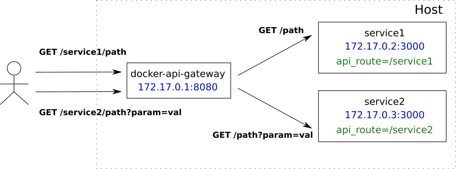

# docker-api-gateway-example

This project is a simple example of API Gateway pattern for [microservices](http://microservices.io/patterns/apigateway.html) implemented in Node.js.

It's **not production-ready** service and its sole purpose is to demonstrate usage of **node-docker-monitor** and **http-proxy** npm modules.

Service reacts on Docker events and as Docker containers go up and down, it creates or removes HTTP routing rules for them. 
To indicate that a container is to be handled by the gateway it must have label **api_route** defining URL prefix for that container 
plus it must EXPOSE port that containerised service listens on. 



To be able to monitor local Docker instance, we need to make UNIX socket `/var/run/docker.sock` available to the container.

``` 
docker run -d --name api-gateway -v /var/run/docker.sock:/var/run/docker.sock -p 80:8080 beh01der/docker-api-gateway-example
```

An upstream service can be started with command similar to (depending on your service implementation)

```
docker run -d --name service1 -e SERVICE_NAME=service1 -l=api_route='/service1' --expose 3000 beh01der/web-service-dockerized-example
```

When upstream service containers are being discovered we should see output like

```
$ docker logs api-gateway
Registered new api route: {"apiRoute":"/service1","upstreamUrl":"http://172.17.0.2:3000"}
Registered new api route: {"apiRoute":"/service2","upstreamUrl":"http://172.17.0.3:3000"}
```

Now, we can test it

```
$ curl 127.0.0.1/service1
Hello World!
I am service 1!
```
